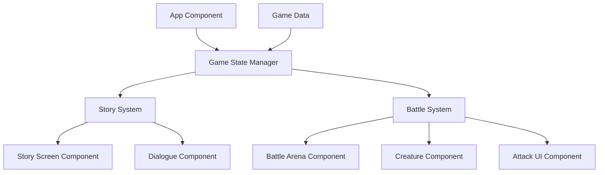

# Design Document

## Overview

The story-battle game is a React-based web application that combines sequential narrative storytelling with turn-based Pokemon-like battles. The application uses a state machine approach to manage transitions between story screens and battle sequences, with React components handling UI rendering and animations.

The game flow follows this pattern:

1. Entry screen with start button
2. Sequential story screens with animated dialogue
3. Battle sequences triggered at specific story points
4. Return to story progression after battle completion

## Architecture

### High-Level Architecture



### Component Hierarchy

- **App**: Root component managing global game state
- **GameStateManager**: Controls transitions between story and battle modes
- **StoryScreen**: Renders background, characters, and dialogue for story sequences
- **DialogueBubble**: Displays animated text with navigation controls
- **BattleArena**: Manages battle UI layout and turn flow
- **CreatureDisplay**: Shows creature sprite, HP, and level
- **AttackPanel**: Renders attack buttons and handles player input

### State Management

The application uses React's useState and useReducer hooks for state management:

- **gameMode**: Tracks current mode (entry, story, battle)
- **currentScene**: Index of the current story scene
- **battleState**: Contains battle-specific data (creatures, HP, turn state)
- **dialogueState**: Manages text animation and navigation availability

## Components and Interfaces

### 1. Game State Manager

**Purpose**: Orchestrates transitions between game modes and maintains global state

**State Structure**:

```javascript
{
  mode: 'entry' | 'story' | 'battle',
  currentSceneIndex: number,
  storyData: Array<Scene>,
  playerProgress: {
    completedScenes: number[],
    playerCreature: Creature
  }
}
```

**Key Methods**:

- `startGame()`: Transitions from entry to first story scene
- `advanceStory()`: Moves to next story scene or triggers battle
- `startBattle(opponentData)`: Initializes battle state
- `endBattle(result)`: Returns to story progression

### 2. Story Screen Component

**Purpose**: Renders story scenes with backgrounds, characters, and dialogue

**Props**:

```javascript
{
  sceneData: {
    backgroundImage: string,
    character: {
      sprite: string,
      position: 'left' | 'right' | 'center'
    },
    dialogue: string,
    speaker: string
  },
  onAdvance: () => void
}
```

**Features**:

- Background image transitions with fade effects
- Character sprite positioning
- Integration with DialogueBubble component

### 3. Dialogue Bubble Component

**Purpose**: Displays character dialogue with typewriter animation

**Props**:

```javascript
{
  text: string,
  speaker: string,
  onComplete: () => void,
  onAdvance: () => void
}
```

**State**:

- `displayedText`: Currently visible portion of text
- `isAnimating`: Whether typewriter effect is active
- `showArrow`: Navigation arrow visibility

**Animation Logic**:

- Text reveals character-by-character at 50ms intervals
- Arrow appears only after animation completes
- Click handler advances to next scene

### 4. Battle Arena Component

**Purpose**: Manages battle UI and turn-based combat flow

**State Structure**:

```javascript
{
  playerCreature: Creature,
  opponentCreature: Creature,
  currentTurn: 'player' | 'opponent',
  battleLog: string[],
  isAnimating: boolean
}
```

**Battle Flow**:

1. Player selects attack
2. Damage calculation and HP update
3. Check for battle end condition
4. Opponent turn (random attack selection)
5. Damage calculation and HP update
6. Check for battle end condition
7. Return to step 1 or end battle

### 5. Creature Display Component

**Purpose**: Shows creature sprite, stats, and HP bar

**Props**:

```javascript
{
  creature: {
    name: string,
    sprite: string,
    level: number,
    currentHP: number,
    maxHP: number
  },
  position: 'left' | 'right'
}
```

**Visual Elements**:

- Creature sprite image
- HP bar with percentage-based width
- Level indicator
- Name label

### 6. Attack Panel Component

**Purpose**: Displays available attacks as interactive buttons

**Props**:

```javascript
{
  attacks: Array<{
    id: string,
    name: string,
    damage: number,
    unlockLevel: number
  }>,
  creatureLevel: number,
  onAttackSelect: (attackId) => void,
  disabled: boolean
}
```

**Logic**:

- Filters attacks based on creature level
- Disables buttons during opponent turn
- Displays attack name and damage value

## Data Models

### Scene Model

```javascript
{
  id: number,
  type: 'story' | 'battle',
  backgroundImage: string,
  character?: {
    sprite: string,
    position: string,
    name: string
  },
  dialogue?: string,
  battleData?: {
    opponentCreature: Creature
  }
}
```

### Creature Model

```javascript
{
  id: string,
  name: string,
  sprite: string,
  level: number,
  maxHP: number,
  currentHP: number,
  attacks: Array<Attack>
}
```

### Attack Model

```javascript
{
  id: string,
  name: string,
  damage: number,
  unlockLevel: number
}
```

## Error Handling

### Story System Errors

- **Missing scene data**: Display error message and prevent navigation
- **Invalid scene index**: Reset to last valid scene
- **Image loading failures**: Show placeholder background/sprite

### Battle System Errors

- **Invalid attack selection**: Disable button and show error message
- **Negative HP values**: Clamp HP to minimum of 0
- **Undefined creature data**: End battle and return to story with error state

### General Error Boundaries

- Wrap main game components in React Error Boundary
- Log errors to console for debugging
- Display user-friendly error messages
- Provide "Return to Start" option on critical errors

## Testing Strategy

### Unit Testing Focus

- **Damage calculation logic**: Verify HP reduction matches attack damage
- **Attack filtering by level**: Ensure only appropriate attacks are available
- **Battle end condition detection**: Test HP = 0 triggers battle end
- **Text animation timing**: Verify character-by-character reveal

### Integration Testing Focus

- **Story-to-battle transitions**: Verify state changes correctly
- **Battle-to-story returns**: Ensure story resumes at correct scene
- **Player input flow**: Test complete attack selection and resolution cycle

### Manual Testing Scenarios

- Complete story progression from entry to multiple scenes
- Win and lose battle scenarios
- Rapid clicking during text animation
- Navigation through all story branches

## Technical Considerations

### Performance

- Preload images for next 2-3 scenes to prevent loading delays
- Use CSS transforms for animations (GPU acceleration)
- Debounce rapid click events on navigation arrows
- Lazy load battle assets only when battle initiates

### Responsive Design

- Mobile-first approach with touch-friendly button sizes
- Flexible layout adapting to different screen sizes
- Portrait and landscape orientation support
- Minimum viewport: 375px width

### Browser Compatibility

- Target modern browsers (Chrome, Firefox, Safari, Edge)
- Use CSS Grid and Flexbox for layouts
- Fallback fonts for text rendering
- Test on iOS Safari and Chrome Android

### Asset Management

- Store sprites and backgrounds in `/public` directory
- Use consistent naming convention: `{type}-{name}.png`
- Optimize images for web (compressed PNG/WebP)
- Provide 2x resolution assets for high-DPI displays
